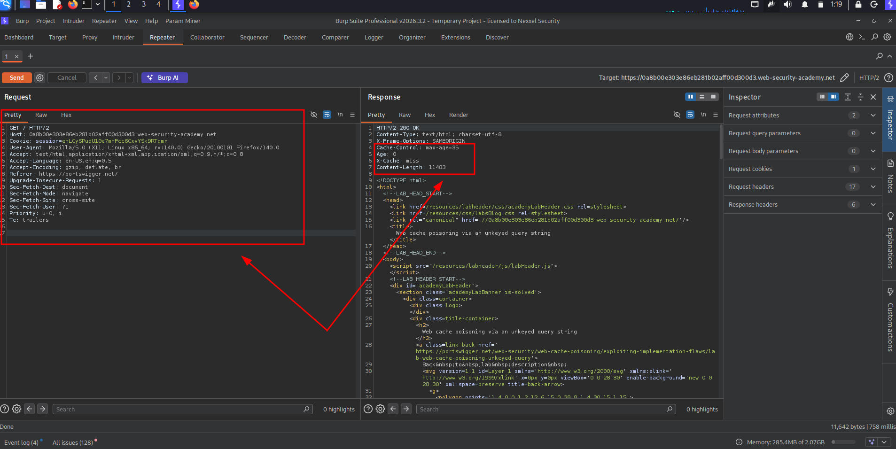

# Lab: Web cache poisoning via an unkeyed query string

This lab is vulnerable to web cache poisoning because the query string is unkeyed. A user regularly visits this site's home page using Chrome.

To solve the lab, poison the home page with a response that executes `alert(1)` in the victim's browser.

***

Let's Start

<figure><figcaption></figcaption></figure>

We Capture The Request In Home Page and We Got Web Cache Server Response !!

<figure><figcaption></figcaption></figure>

Than I add The Parameter and also a Xss Payload !!

<figure><figcaption></figcaption></figure>

Refresh The Home Page and We Got The alert !!

<figure><figcaption></figcaption></figure>
