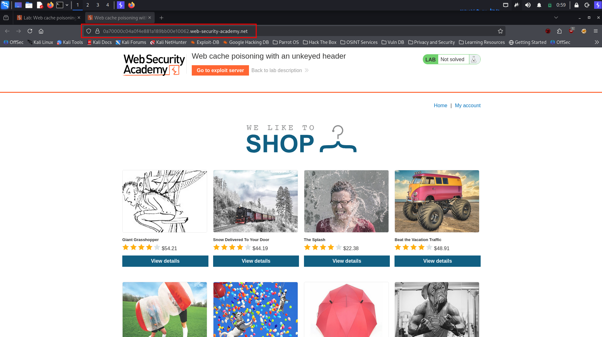

# Lab: Web cache poisoning with an unkeyed header

This lab is vulnerable to web cache poisoning because it handles input from an unkeyed header in an unsafe way. An unsuspecting user regularly visits the site's home page. To solve this lab, poison the cache with a response that executes `alert(document.cookie)` in the visitor's browser.

***

Hacker

<figure><figcaption></figcaption></figure>

Hacker

<figure><figcaption></figcaption></figure>

Hacker

<figure><figcaption></figcaption></figure>
