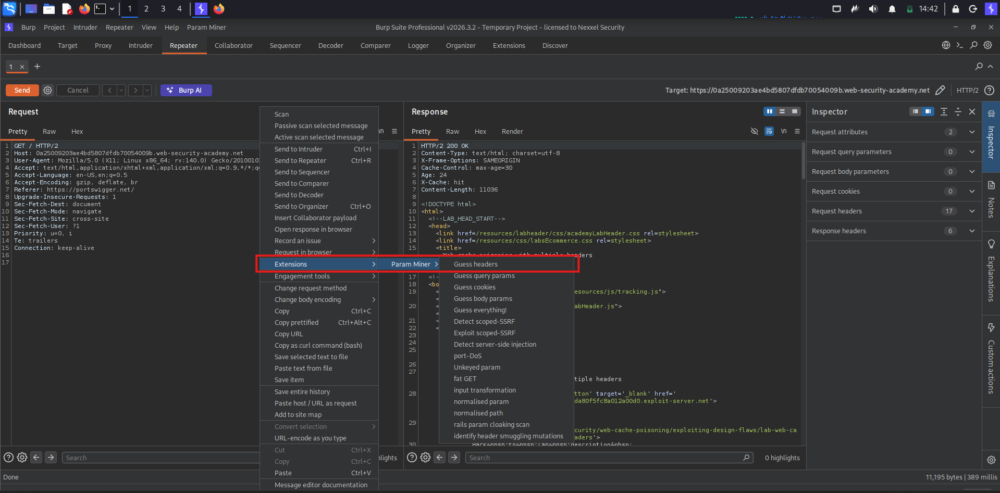

# Lab: Web cache poisoning with multiple headers

This lab contains a web cache poisoning vulnerability that is only exploitable when you use multiple headers to craft a malicious request. A user visits the home page roughly once a minute. To solve this lab, poison the cache with a response that executes `alert(document.cookie)` in the visitor's browser.

***

Let's Start , First Explore The Website and Capture The Home Request In Burpsuite  !!

<figure><figcaption></figcaption></figure>

Here We Get The Response of The Home Page and They Show Three Headers it's Mean Server Use Cache Server !!

<figure><figcaption></figcaption></figure>

We Use The Burp Extension To Find The Headers !!

<figure><figcaption></figcaption></figure>

We Got a This Header --> `X-Forwarded-Scheme` and It's Work is To Send The Request in Http , https and Different protocols ,&#x20;

<figure><figcaption></figcaption></figure>

`Location` header shows that you are being redirected to the same URL that you requested, but using `https://`.

<figure><figcaption></figcaption></figure>

We Use The Header Finder Extension again and We Got another Header `X-Forwarded-Host`  !!

<figure><figcaption></figcaption></figure>

Send this request and notice that the `Location` header of the 302 redirect now points to `https://evil.com/`.

<figure><figcaption></figcaption></figure>

We Find The Static Resources and This Help to Serve The malicious Code In Static Resources !!

<figure><figcaption></figcaption></figure>

We Setup The Exploit Server !!

<figure><figcaption></figcaption></figure>

Send The Request !!

<figure><figcaption></figcaption></figure>

Boom We Got alert Function !!

<figure><figcaption></figcaption></figure>

Lab Solve automatically in 1 minute !!

<figure><figcaption></figcaption></figure>
